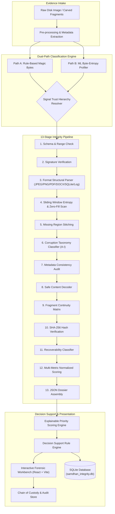

# SAMDHAN AI — Digital Forensics & Carved Fragment Triaging Platform

> **An advanced, explainable forensic engineering platform for automated fragment reassembly, multi-stage data integrity assessment, dual-path classification, and investigative decision support.**

---

## 📌 Overview

During digital forensics investigations (e.g., deleted file recovery, compromised disk parsing, ransomware remediation, or unallocated space analysis), forensic tools carves out raw chunks of binary data (fragments). Forensic examiners are frequently overwhelmed by thousands of disconnected fragments, corrupted containers, and spoofed file extensions.

**SAMDHAN AI** solves this bottleneck by providing an end-to-end automated triage, integrity verification, and decision-support pipeline:
1. **Reconstructs and stitches** raw carved fragments.
2. **Evaluates multi-dimensional data integrity** using an automated 13-stage assessment engine.
3. **Classifies file types** using a dual-path engine (deterministic magic bytes + statistical ML byte entropy).
4. **Calculates explainable priority scores** isolating high-value evidence from system noise.
5. **Generates actionable triage decisions** (`RECOVERABLE`, `PARTIALLY_RECOVERABLE`, `NEEDS_REVIEW`, `UNRECOVERABLE`) with human-readable justifications and chain-of-custody audit logs.

---

## ⚡ Key Highlights & Core Features

### 1. 🔍 Multi-Stage Data Integrity & Corruption Assessment Pipeline
A 13-stage analytical pipeline processing raw artifact bytes and metadata:
- **Stage 1 — Input Validation:** Pydantic schema verification, file boundary confirmation, and size checks.
- **Stage 2 — Signature Verification:** Exact magic-byte identification, container envelope detection, and extension mismatch logging.
- **Stage 3 — Structural Validation:** Deep syntax parsing for complex containers (JPEG markers, PNG chunks & CRCs, PDF xref/object tables, DOCX/ZIP central directories, SQLite page headers & cell trees, system logs).
- **Stage 4 — Byte / Block Entropy Analysis:** 512-byte sliding-window Shannon entropy profiling, zero-fill run detection, and byte frequency distributions.
- **Stage 5 — Missing Region Detection:** Gap identification between stitched fragments merged with stream truncation detection.
- **Stage 6 — Corruption Taxonomy Classification (Types A–I):**
  - **Type A — Missing Data:** Bytes never recovered from any carved fragment.
  - **Type B — Fragment Gap:** Expected inter-fragment bytes unavailable or skipped.
  - **Type C — Byte Corruption:** Bytes present but inconsistent (e.g., zero-fill streaks or abrupt entropy crashes).
  - **Type D — Structural Corruption:** Damaged container envelope, corrupt headers, or invalid chunk tables.
  - **Type E — Metadata Corruption:** Timestamp inversion, invalid EXIF tags, or missing timestamps.
  - **Type F — Encoding Corruption:** Malformed UTF-8/ASCII streams or unparseable text blocks.
  - **Type G — Container Corruption:** Corrupted ZIP central directory or SQLite B-tree leaf damage.
  - **Type H — Partial Content Corruption:** Header and index intact, but secondary pages/frames unreadable.
  - **Type I — Unknown / Uncertain:** Unclassified anomalies requiring manual examiner inspection.
- **Stage 7 — Metadata Consistency Cross-Check:** Flags filesystem timestamp tampering (e.g., filesystem modified time preceding internal document creation time).
- **Stage 8 — Content Decoding:** Safe decoding attempts via non-executing sandboxed parsers.
- **Stage 9 — Fragment Continuity Analysis:** Boundary alignment, offset overlap, and inter-fragment entropy transitions.
- **Stage 10 — Hash Verification:** SHA-256 cryptographic recomputation against known custody baselines.
- **Stage 11 — Recoverability Assessment:** Deterministic mapping into triage recovery tiers.
- **Stage 12 — Normalized Scoring:** Weighted aggregate score balancing structural, content, fragment, and metadata dimensions.
- **Stage 13 — Report Assembly & Persistence:** Structured JSON dossier generated and saved into SQLite.

---

### 2. 🧠 Dual-Path Classification Engine
Implements a strict signal trust hierarchy to prevent anti-forensic spoofing:
- **Signal Trust Hierarchy (Highest to Lowest):**
  1. Magic bytes / exact file signatures
  2. Internal structural validity
  3. MIME type detection
  4. Statistical content features (entropy, printable byte ratio, frequency histogram)
  5. Timestamps / filesystem metadata
  6. Filename & extension *(Lowest trust — trivially renamed by adversaries)*
- **Path A (Deterministic Rule-Based):** Instant hex matching across 20+ file formats (PDF, DOCX, OLE2, RTF, JPEG, PNG, GIF, BMP, TIFF, SQLite, EVTX, PCAP, PCAPNG, REGF, PE/MZ).
- **Path B (Machine Learning Byte-Entropy):** GradientBoosting-style statistical inference analyzing byte distributions for extension-less fragments and obfuscated files.
- **Anti-Spoofing Detection:** When an executable header (`MZ`) is masked with an `.jpg` extension, SAMDHAN AI flags the conflict immediately rather than trusting the extension.

---

### 3. 🎯 Transparent & Justifiable Priority Scoring
Prioritizes evidence based on forensic relevance, incident timeline, and artifact integrity while decoupling classification confidence:

$$\text{Priority} = 0.30 \times \text{Integrity} + 0.35 \times \text{Relevance} + 0.20 \times \text{Recency} + 0.15 \times \text{Uniqueness} - 0.10 \times \text{NoisePenalty}$$

- **Integrity ($w_1 = 0.30$):** Structural completeness and decoding validity.
- **Relevance ($w_2 = 0.35$):** IOC match strength, keyword hits, and investigator queries.
- **Recency ($w_3 = 0.20$):** Proximity to the incident time window (`incidentStart` to `incidentEnd`).
- **Uniqueness ($w_4 = 0.15$):** Deduplication penalty using ssdeep fuzzy hashing; exact duplicates receive $0$.
- **Noise Penalty ($w_5 = 0.10$):** Heuristic reduction for operating system caches (`thumbs.db`, `/tmp/`, `pagefile.sys`, browser cache).
- **Confidence Isolation Rule:** Classification confidence is **deliberately excluded** from the score to prevent a 99% confident junk file (e.g. standard wallpaper thumbnail) from masquerading as high-priority evidence. Low confidence triggers an independent **Review Flag**.

#### Priority Tiers:
| Priority Tier | Score Range | Operational Meaning |
| :--- | :--- | :--- |
| **Critical** | $\ge 0.75$ | Core case evidence; inspect immediately |
| **High** | $0.50 - 0.74$ | Strong relevance or key system activity |
| **Medium** | $0.25 - 0.49$ | Ancillary context or partial evidence |
| **Low** | $< 0.25$ | Background noise or degraded remnants |

---

### 4. ⚖️ Investigative Decision Support & Evidence Dossier
Transforms complex mathematical outputs into operational decision paths:
- **Decision States:**
  - `RECOVERABLE`: High integrity ($\ge 85\%$), complete fragments, clean headers.
  - `PARTIALLY_RECOVERABLE`: Moderate integrity ($\ge 40\%$), critical fragments readable, minor gaps.
  - `NEEDS_REVIEW`: Conflicted classification, confidence $< 60\%$, or anomalous entropy patterns.
  - `UNRECOVERABLE`: Major structural destruction, corrupted leaf pages, unparseable headers.
- **Explainability Panel ("Why This Decision"):** 3 to 5 clear, bulleted justifications detailing fragment coverage, structural checks, corruption findings, and confidence ratings.
- **Evidence Panel Assembler:** Comprehensive breakdown across 5 categories:
  1. *Fragments* (Carved fragments used, offsets, alignment confidence)
  2. *Integrity* (Structural, content, metadata, fragment continuity)
  3. *Classification* (Signature path, ML confidence, MIME identification)
  4. *Priority* (Detailed mathematical weight breakdown)
  5. *Forensic Context* (IOC associations, timeline alignment, file provenance)

---

### 5. 🛡️ Audit Trail & Chain of Custody
- **Tamper-Evident Logging:** Captures all user triage actions, analyst overrides, and manual confirmations.
- **Custody Attestations:** Explicitly logs read-only physical image sources (`DERIVED_FROM_READ_ONLY_IMAGE_UNMODIFIED`).
- **Cryptographic Export:** One-click export of complete forensic dossiers with SHA-256 hashes for court readiness.

---

### 6. 🔬 Comprehensive Forensic UI
- **Cyber Command Banner:** Real-time metrics bar with IOC badges, active case indicators, and quick status indicators.
- **Forensic Table & Grid View:** Filter by artifact category (*Documents, Photos, DB Logs, System Traces*), priority tier, or review status.
- **Entropy & Byte Distribution Visualizer:** Interactive charts plotting Shannon entropy across 512-byte sliding windows.
- **Hex Preview & Boundary Map:** Color-coded fragment boundary mapping and live hex preview.
- **AI vs. Rule Comparison Modal:** Side-by-side inspection comparing deterministic signatures against ML statistical predictions.
- **Gated Recovery Center:** Restrict raw reconstruction exports until examiner verification requirements are met.

---

## 🏗️ System Architecture



---

## 📂 Project Structure

```
Samdhan-AI/
├── backend/
│   ├── demo_data/
│   │   ├── fixtures/             # Generated fixture metadata (JSON)
│   │   └── reconstructed/        # Synthetic binary artifacts (JPEG, PDF, DB, etc.)
│   ├── generate_demo_data.py     # Generates 15 synthetic forensic test artifacts
│   └── integrity_pipeline.py     # FastAPI backend & 13-stage integrity pipeline
├── public/                       # Static public assets
├── src/
│   ├── assets/                   # Forensic icons and branding
│   ├── components/
│   │   ├── AiVsRuleModal.jsx     # Side-by-side signature vs ML comparison
│   │   ├── ArtifactDetailModal.jsx # Detailed forensic dossier & hex viewer
│   │   ├── ArtifactTable.jsx     # Sortable, filterable artifact data table
│   │   ├── AuditLogModal.jsx     # Chain of custody audit trail modal
│   │   ├── DashboardScreen.jsx   # Primary triage dashboard
│   │   ├── Header.jsx            # Application navigation & case status bar
│   │   ├── HeroCyberBanner.jsx   # High-level forensic telemetry & IoC tags
│   │   ├── InputScreen.jsx       # Case creation & evidence ingestion interface
│   │   ├── IntegrityDashboard.jsx# Sliding-window entropy & corruption taxonomy visualizer
│   │   ├── InvestigationCenter.jsx # Gated decision support & recovery workspace
│   │   └── ProcessingScreen.jsx  # Animated 13-stage pipeline execution view
│   ├── data/
│   │   ├── demoArtifacts.js      # 15 benchmark forensic artifacts with scoring
│   │   └── mockForensicData.js   # Incident profiles, sample cases, and audit logs
│   ├── engine/
│   │   ├── classificationEngine.js # Path A (rules) + Path B (entropy) classifiers
│   │   ├── decisionSupportEngine.js# 4-state decision mapper & explanation generator
│   │   └── priorityEngine.js     # Multi-factor priority scoring algorithm
│   ├── utils/
│   │   └── forensicUtils.js      # Formatting, hashing, and byte helpers
│   ├── App.jsx                   # Main React state container & screen router
│   ├── index.css                 # Cyber-forensic design tokens & styling
│   └── main.jsx                  # React application entry point
├── package.json                  # Frontend dependencies and npm scripts
├── samdhan_integrity.db          # SQLite persistent database
├── tailwind.config.js            # Tailwind CSS configuration
├── vite.config.js                # Vite build and dev server configuration
└── README.md                     # Project documentation
```

---

## 🧪 Synthetic Benchmark Dataset (15 Artifacts)

The project includes a generator (`generate_demo_data.py`) simulating real forensic disk carving scenarios:

| Artifact ID | File Name | Format | Scenario & Corruption Type | Expected Decision |
| :--- | :--- | :--- | :--- | :--- |
| **ART-001** | `art001_jpeg_intact.jpg` | JPEG | Complete image, valid SOI/APP0/DQT/SOF/EOI | `RECOVERABLE` |
| **ART-002** | `art002_jpeg_missing_tail.jpg` | JPEG | Missing EOF trailer (Type A: Missing Data) | `PARTIALLY_RECOVERABLE` |
| **ART-003** | `art003_jpeg_corrupted_mid.jpg` | JPEG | Mid-stream zero-fill anomaly (Type C: Byte Corruption) | `NEEDS_REVIEW` |
| **ART-004** | `art004_pdf_intact.pdf` | PDF | Valid PDF-1.7, complete xref & trailer table | `RECOVERABLE` |
| **ART-005** | `art005_pdf_damaged_obj.pdf` | PDF | Damaged internal stream object (Type D: Structural) | `PARTIALLY_RECOVERABLE` |
| **ART-006** | `art006_pdf_missing_page.pdf` | PDF | Page catalog references uncarved block (Type A) | `NEEDS_REVIEW` |
| **ART-007** | `art007_docx_intact.docx` | DOCX | Valid OOXML ZIP container & XML document body | `RECOVERABLE` |
| **ART-008** | `art008_docx_damaged_xml.docx` | DOCX | Corrupted `word/document.xml` stream (Type F) | `PARTIALLY_RECOVERABLE` |
| **ART-009** | `art009_docx_broken_zip.docx` | DOCX | Corrupted central directory header (Type G) | `UNRECOVERABLE` |
| **ART-010** | `art010_sqlite_intact.db` | SQLite | Intact SQLite 3 database with auth audit records | `RECOVERABLE` |
| **ART-011** | `art011_sqlite_damaged_page.db` | SQLite | Damaged B-tree leaf page header (Type D) | `PARTIALLY_RECOVERABLE` |
| **ART-012** | `art012_sqlite_missing_records.db`| SQLite | Truncated tail pages (Type A: Missing Data) | `PARTIALLY_RECOVERABLE` |
| **ART-013** | `art013_log_complete.log` | LOG | Complete SSH authentication event log | `RECOVERABLE` |
| **ART-014** | `art014_log_missing_lines.log` | LOG | Truncated log stream (Type A: Missing Lines) | `PARTIALLY_RECOVERABLE` |
| **ART-015** | `art015_log_malformed.log` | LOG | Malformed binary/null insertions in log (Type F) | `NEEDS_REVIEW` |

---

## 🚀 Getting Started

### Prerequisites
- **Node.js** v18+ and **npm**
- **Python** v3.10+ (with `pip`)

---

### Step 1: Clone & Install Frontend Dependencies

```bash
# Clone the repository
git clone https://github.com/shettyadi57/Samdhan-AI.git
cd Samdhan-AI

# Install frontend dependencies
npm install
```

---

### Step 2: Set Up Python Backend Dependencies

```bash
# Install required Python libraries
pip install fastapi uvicorn pydantic numpy
```

*(Optional: Pillow and reportlab for advanced image/PDF rendering tests)*

---

### Step 3: Generate the Forensic Demo Dataset

Run the synthetic data generator to create test fixtures in `backend/demo_data/`:

```bash
python backend/generate_demo_data.py
```

---

### Step 4: Run the Backend API Server

Start the FastAPI application via Uvicorn:

```bash
python -m uvicorn backend.integrity_pipeline:app --host 127.0.0.1 --port 8001 --reload
```

- **API Base URL:** `http://127.0.0.1:8001`
- **Interactive Swagger Docs:** `http://127.0.0.1:8001/docs`
- **ReDoc:** `http://127.0.0.1:8001/redoc`

---

### Step 5: Run the Frontend Dev Server

In a new terminal window, start Vite:

```bash
npm run dev
```

- **Frontend URL:** `http://localhost:5173` (or `http://localhost:5174` if port 5173 is occupied)

---

## 📡 REST API Reference

| Method | Endpoint | Description |
| :--- | :--- | :--- |
| `POST` | `/api/integrity/analyze` | Executes the full 13-stage integrity pipeline on an artifact payload. |
| `GET` | `/api/artifacts` | Lists all cataloged artifacts with overall scores, severities, and recoverability. |
| `GET` | `/api/integrity/{artifact_id}/summary` | Returns a summary integrity scorecard for a specific artifact. |
| `GET` | `/api/integrity/{artifact_id}/regions` | Fetches detected byte-corruption regions, severities, and descriptions. |
| `GET` | `/api/integrity/{artifact_id}/report` | Retrieves complete forensic report, validation log, and decision justifications. |
| `POST` | `/api/integrity/batch` | High-throughput batch assessment for multiple artifacts. |

---

## 🔒 Forensic Standards & Principles Adhered To

1. **Chain of Custody Integrity:**
   - Raw source hashes are verified and never overwritten.
   - Operations operate in memory or export to dedicated carved outputs.
2. **Transparent Explainability:**
   - No black-box prioritization.
   - Every priority rating provides an itemized weight breakdown ($w_1$ to $w_5$).
3. **Decoupled Classification Confidence:**
   - High classification confidence on irrelevant files does not distort operational urgency.
4. **Anti-Forensic Resilience:**
   - Relies on internal binary structures and byte frequencies rather than easily manipulated file extensions or timestamps.

---

## 💻 Tech Stack

- **Frontend:** React 19, Vite, Tailwind CSS, Lucide React, Recharts
- **Backend:** Python 3, FastAPI, Uvicorn, SQLite 3, NumPy, Pydantic
- **Testing & Data Generation:** Custom binary struct generators, zlib, zipfile

---

## 📄 License

This project is developed for forensic research, incident response, and hackathon demonstration purposes. Distributed under the MIT License.
