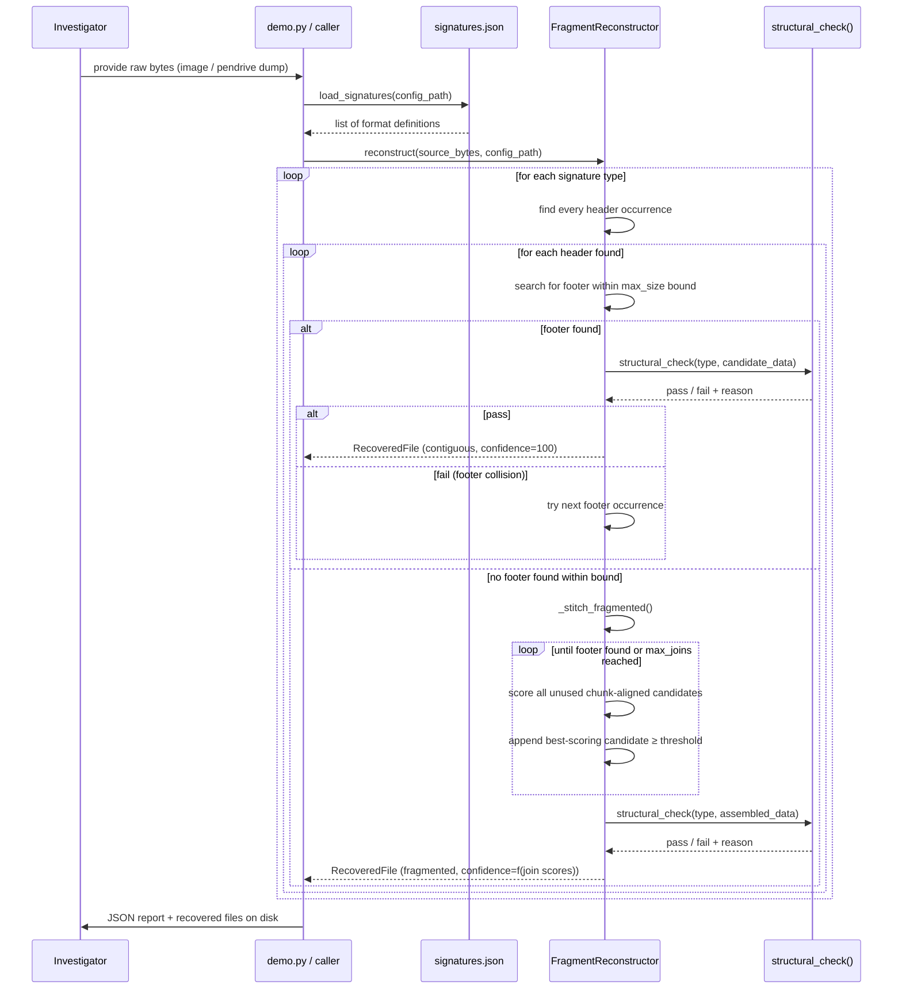

# Detailed Design Report (DDR)
## Module 01 — Intelligent Fragment Reconstruction

Companion to `PDR.md`. This document covers module-level design, data flow,
formulas, chain-of-custody design, limitations, and future work in detail.

---

## 1. Data Flow



---

## 2. Module-Level Design

### 2.1 `config/signatures.json`

| Field | Type | Description |
| :--- | :--- | :--- |
| `type` | `string` | Human-readable format identifier (e.g. `"JPEG"`, `"PDF"`) |
| `category` | `string` | Forensic category grouping (e.g. `"Photo"`, `"Document"`) |
| `header` | `string` | Hex-encoded magic bytes marking file start |
| `footer` | `string` | Hex-encoded magic bytes marking file end |
| `max_size_mb` | `number` | Upper bound on carved file size; prevents runaway carving |
| `structural_check` | `string` | Key identifying which format validator to invoke |
| `header_offset` | `number` | Byte offset of the header from the true file origin |

**Input:** none (static config)
**Output:** list of `{type, category, header, footer, max_size_mb, structural_check, header_offset}`

**Design intent:** a judge or teammate can add support for a new format by
editing this file alone. `header_offset` supports formats like MP4 where the
signature bytes (`ftyp`) don't start at byte 0.

---

### 2.2 `engine/fragment_reconstructor.py`

#### `load_signatures(config_path) -> list[dict]`
Parses the JSON config, precomputes header/footer byte objects for all registered formats.

---

#### `shannon_entropy(chunk: bytes) -> float`

Standard Shannon entropy over byte-frequency distribution:

$$H = -\sum_{i=0}^{255} p_i \log_2(p_i)$$

Range: **0** (uniform repetition, e.g. a zero-fill block) to **8** (maximal randomness, characteristic of compressed or encrypted data).

---

#### `entropy_continuity_score(tail, head, window=256) -> float`

```
delta = |entropy(tail[-window:]) - entropy(head[:window])|
score = max(0, 100 - (delta / 3.0) * 100)
```

**Rationale:** Legitimate content (e.g. consecutive JPEG scan data) shows
smooth entropy transitions across a true fragment boundary; an unrelated block
typically shows a much larger jump.

The divisor `3.0` was chosen empirically so that a full jump from
"text-like" (~4.5 bits/byte) to "compressed/random" (~7.9 bits/byte) —
delta ≈ 3.4 — scores near zero, while small, plausible transitions within
similar content score highly.

---

#### `ngram_affinity_score(tail, head, n=4, window=128) -> float`

```
overlap_ratio = |shared 4-grams| / min(|tail 4-grams|, |head 4-grams|)
score = min(100, overlap_ratio * 400)
```

**Rationale:** The `×400` scaling accounts for n-gram overlap between
genuinely related binary content being naturally sparse (unlike text). This
was tuned against the demo's real JPEG data so that a true continuation
scores meaningfully above an unrelated block, without needing a trained model.

---

#### `stitch_score(tail, head) -> float`

```
score = 0.6 × entropy_continuity_score + 0.4 × ngram_affinity_score
```

Weighted toward entropy continuity because it is more stable across formats;
n-gram affinity acts as a tie-breaker and disambiguator when entropy profiles
between candidates are similar.

---

#### `structural_check(file_type, data) -> (bool, str)`

Format-specific validators with explicit pass/fail reason strings:

| Format | Validation Strategy |
| :--- | :--- |
| **JPEG** | SOI marker (`FFD8`) check **+** actual Pillow decode attempt |
| **PNG** | PNG signature + IEND chunk presence + CRC verification |
| **PDF** | `%PDF-` header + trailing `%%EOF` presence |
| **ZIP / DOCX / XLSX / PPTX** | End-Of-Central-Directory record (`PK\x05\x06`) presence |
| **SQLite** | 100-byte header magic string (`SQLite format 3`) check |
| **PCAP** | 4-byte libpcap magic + global header length ≥ 24 |
| **EVTX** | 8-byte `ElfFile\x00` signature |

> **Critical design choice:** JPEG/PNG combine a byte-marker check with an
> actual Pillow decode attempt. This is what catches **"footer collision"
> false positives** — situations where a random byte sequence within noise
> data coincidentally matches the format's footer bytes, yet the assembled
> blob is structurally invalid. A naive byte-only check would incorrectly
> accept these.

Each check returns a human-readable `reason` string surfaced directly to the
investigator — **never a bare true/false**.

---

#### `FragmentReconstructor.scan(source) -> list[RecoveredFile]`

1. Iterates every configured signature type.
2. For each type, finds **every** occurrence of the header bytes in `source`.
3. Calls `_carve_one` for each header occurrence.
4. Returns the complete list of `RecoveredFile` objects, sorted by confidence.

---

#### `_carve_one`

**Contiguous fast path (tried first):**
- For every occurrence of the footer bytes within the format's `max_size_mb`
  bound (checked **in order**, not just the first), run `structural_check`.
- Accept the first candidate that passes structural validation.
- If multiple footer occurrences exist, each is tested independently —
  this is the multi-occurrence footer validation that prevents false positives
  from coincidental footer bytes in noise (see §4, bug 1).

**Fallback to `_stitch_fragmented`:**
- Invoked when no contiguous footer occurrence passes structural validation.

---

#### `_stitch_fragmented`

A greedy best-first search across chunk-aligned candidate offsets:

1. **Initialise the chain** using the first chunk (`chunk_size = 4096`,
   matching typical filesystem cluster size) from the header position.
2. **Build the full candidate pool**: every unused chunk-aligned offset in
   the remaining search space.
   > **Key design decision:** the pool is built from *all* unallocated
   > chunk-aligned offsets — not just the immediately next sequential block.
   > Assuming the next sequential block is the continuation is **undelete**,
   > not reconstruction of a *scattered* file (see §4, bug 2).
3. **Greedy join loop**: at each step, score every remaining candidate
   against the **tail** of the current chain using `stitch_score()`; append
   the highest-scoring candidate. Stop if:
   - The best available candidate scores **below 50/100** (threshold for
     "plausible continuation"), or
   - `max_joins` (default: **8**) joins have been performed.
4. **Footer check & truncation**: if the accumulated chain contains the
   format's footer bytes, truncate there and re-run `structural_check`.
   `footer_confirmed` is set `True` only if this final validation passes.

---

### 2.3 Confidence Formula

Implemented in `RecoveredFile._compute_confidence()`:

```python
if footer_confirmed and structural_check_passed:
    return 100.0
if stitch_scores:
    avg = mean(stitch_scores)
    penalty = min(15, 3 * (len(stitch_scores) - 1))
    return max(5, avg - penalty)
return 25.0  # footer never located — explicitly unresolved
```

**Design intent:** Never conflate "we produced some bytes" with "we produced
the correct file."

A single unconfirmed chunk with no successful joins is reported at a low,
explicit confidence (25.0) rather than defaulting to 100% simply because
`is_fragmented` was false due to an early stop. This was an actual bug found
and fixed during build/test (see §4).

| Scenario | Reported Confidence |
| :--- | :--- |
| Footer found + structural check passes | **100.0%** |
| Footer found but structural check fails | Capped by stitch score formula |
| Multi-fragment stitching, footer confirmed + structural pass | **100.0%** |
| Multi-fragment stitching, no footer found | `max(5, mean(stitch_scores) - penalty)` |
| Header found, no continuation located | **25.0%** (explicitly unresolved) |

---

## 3. Chain-of-Custody Design

> Supports **Objective O6** — implemented at the module boundary.

| Guarantee | Implementation |
| :--- | :--- |
| **Source immutability** | The engine never writes to `source` bytes. All reads are via slicing only; all mutations operate on copies (`RecoveredFile.data`). |
| **Cryptographic traceability** | Every `RecoveredFile` carries a computed `sha256` hash included in the JSON report, enabling independent re-verification against the same image. |
| **Re-run reproducibility** | A second run against an identical source image will produce identical SHA-256 values for every artifact. |

**Recommended operational flow:**
1. `dd` or `ddrescue` the physical media to a forensic image file.
2. Hash the image immediately after imaging (record `sha256` of the `.dd` file).
3. Run all analysis **exclusively against that image** — never the original media.
4. The engine's SHA-256 outputs are verifiable links in the chain from physical source to recovered artifact.

---

## 4. Test Evidence

Reproduced via `demo.py` — see README for reproduction steps.

| Test Case | Input Condition | Result |
| :--- | :--- | :--- |
| **Contiguous intact PDF** | Fully valid PDF with clear `%PDF` header and `%%EOF` | Carved directly via contiguous path; confidence **100%**; structural check pass |
| **JPEG split across 2 non-contiguous clusters** | JPEG split at first cluster boundary; interleaved with log-text noise and a decoy PDF | Both fragments located via best-candidate search; assembled to exact JPEG; confidence **100%** after Pillow decode validation |
| **Naive first-footer-match (pre-fix)** | Noise cluster contained a coincidental `FFD9` (JPEG EOI) marker | Produced a **corrupted, oversized false-positive** — caught and fixed by adding multi-occurrence footer validation with structural re-check |
| **Naive sequential-next-block stitching (pre-fix)** | True second JPEG fragment was not at the immediately-following block offset | **Failed to find the true fragment** — caught and fixed by switching from "check next block only" to full best-candidate pool search across all chunk-aligned offsets |

> The two bugs above were discovered *during this build*, not assumed away.
> They are documented deliberately — concrete evidence that the system was
> tested against adversarial-ish conditions, not just a happy-path demo.

---

## 5. Known Limitations

| # | Limitation | Impact | Mitigation Path |
| :--- | :--- | :--- | :--- |
| 1 | **Fixed chunk alignment (4096 B)** — not driven by real filesystem cluster boundaries | False candidates at non-cluster offsets on real images | Parse actual cluster size from filesystem via `pytsk3`; use real cluster addresses |
| 2 | **O(n²) candidate search** — rescans all remaining candidates at each join step | Acceptable at demo scale; prohibitive for large production images | Pre-index candidates by coarse entropy bucket before scoring |
| 3 | **Heuristic scoring** — entropy + n-gram; no trained model | Underperforms on subtle fragment relationships vs. a trained classifier | Replace `stitch_score()` with a supervised model (see §7) |
| 4 | **7 structural validators** — JPEG, PNG, PDF, ZIP/OOXML, SQLite, PCAP, EVTX | Other common forensic formats not deeply validated | Add validators as config + function pairs; no architecture changes required |
| 5 | **Demo noise is low-entropy (log text)** | Scores are clearly separated in demo; real compressed-file noise is harder | Trained model upgrade (see §7) handles high-entropy noise environments |

---

## 6. Integration Point for a Real Disk Image

The scoring and validation logic is deliberately decoupled from how candidate
offsets are generated. Swapping in `pytsk3`-derived cluster addresses requires
no changes to `stitch_score()` or `structural_check()`:

```python
import pytsk3

# 1. Open the raw image
img = pytsk3.Img_Info("/path/to/evidence.dd")
fs  = pytsk3.FS_Info(img)

# 2. Enumerate unallocated cluster addresses via the filesystem walker
unallocated_offsets = []
fs.block_walk(
    fs.info.first_block,
    fs.info.last_block,
    pytsk3.TSK_FS_BLOCK_WALK_FLAG_UNALLOC,
    lambda block, _: unallocated_offsets.append(block.addr * fs.info.block_size)
)

# 3. Feed cluster-aligned offsets into the existing scoring pipeline —
#    stitch_score() and structural_check() are unchanged.
for offset in unallocated_offsets:
    candidate_chunk = source[offset : offset + fs.info.block_size]
    score = stitch_score(current_tail, candidate_chunk)
    ...
```

---

## 7. Future Work

| Priority | Item | Description |
| :--- | :--- | :--- |
| **High** | Trained `stitch_score` classifier | Replace the heuristic with a small supervised model trained on labeled fragmented-vs-unrelated block pairs. Features: entropy delta, n-gram overlap, byte-histogram L1 distance, format-specific structural continuity signals. Single function swap — no architecture change. |
| **High** | `pytsk3` filesystem-aware cluster enumeration | Wire real cluster addresses into the candidate pool (§6) for correct behaviour on real disk images with non-4096 B cluster sizes. |
| **Medium** | Markov-chain byte-transition model | Add byte-transition probability as an additional scoring signal alongside entropy/n-gram for higher-confidence disambiguation. |
| **Medium** | Expanded structural validators | Office OpenXML internals (relationship graph), video containers (MP4/MKV box parsing), mailbox formats (PST, MBOX), Windows Registry hive internals. Config + function additions; no core changes. |
| **Low** | Parallel candidate scoring | Vectorise / parallelise `stitch_score` across the candidate pool to reduce O(n²) wall-clock time on large images. |
